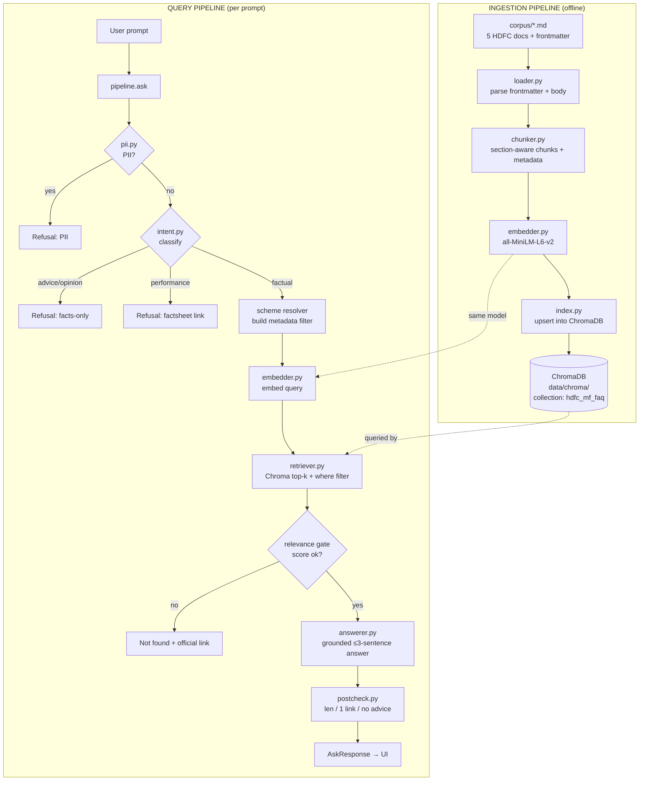
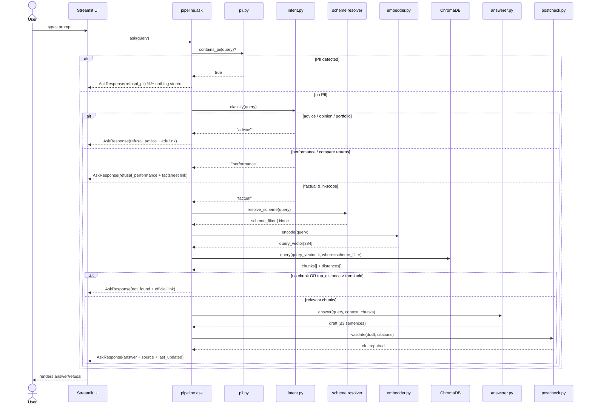

# Architecture — MF FAQ Assistant (Facts-Only RAG Chatbot)

> **Purpose of this file.** This is the engineering blueprint for the product defined in `PRD.md` and the brief in `docs/Buildhour-27th-sept-brief.docx`. It tells an implementer (human or Claude Code) **what we are building**, **how the code is organized**, and — most importantly — **exactly how data flows when a user prompt arrives**. Read `PRD.md` for the *why/what* (goals, requirements, guardrails); read this for the *how*. Where they overlap, the PRD is the source of truth for requirements and this file is the source of truth for structure.

---

## 1. What we are building (in one screen)

A **narrow, grounded, auditable** question-answering chatbot over a **fixed 5-document corpus** of HDFC mutual-fund scheme pages. It answers **factual** questions only (expense ratio, exit load, minimum SIP, ELSS lock-in, riskometer, benchmark, fund manager, NAV/AUM as-of snapshot, statements), and it:

- returns **≤3 sentences** with **exactly one official source link** and a **"Last updated from sources: <date>"** stamp;
- **refuses** advice/opinion/portfolio questions and performance-comparison questions;
- **never** accepts or stores PII; **never** computes/compares returns.

It is a **Retrieval-Augmented Generation (RAG)** system with two pipelines:

1. **Ingestion (offline, run once / on refresh):** `Load → Chunk → Embed → Store` into a vector DB.
2. **Query (online, per prompt):** `Guard → Classify → Resolve scheme → Embed → Retrieve → Gate → Generate → Post-check → Respond`.

**Mandated stack (from brief):** `sentence-transformers/all-MiniLM-L6-v2` embeddings · **ChromaDB** vector store · pipeline stages Loading → Chunking → Embedding → Vector store → Retrieval.

**Design principles**
- **Grounded-only:** the model may state a fact *only if it appears in retrieved context*; otherwise it says "not found." No parametric knowledge.
- **Cheap guards first:** deterministic, near-zero-cost checks (PII regex, intent keywords) run **before** any embedding or LLM call, so unsafe/out-of-scope inputs never reach retrieval.
- **One citation, always:** the citation is derived from retrieved-chunk metadata, not generated by the model — it cannot be hallucinated.
- **Pluggable generation:** the answer composer is an interface with two implementations — an LLM adapter (recommended) and a deterministic template mode — so the system runs with or without an LLM.
- **Metadata-first retrieval:** because all 5 fund pages are near-duplicate in wording, a `scheme` metadata filter matters more than raw vector similarity.

---

## 2. Component map



**Responsibilities**

| Module | Responsibility | Reads | Writes |
|---|---|---|---|
| `ingest/loader.py` | Parse each corpus `.md` into `{frontmatter, body}` | `corpus/*.md` | in-memory docs |
| `ingest/chunker.py` | Split body into section chunks; attach metadata + breadcrumb | docs | chunk records |
| `ingest/embedder.py` | Encode text → 384-dim vectors (shared with query) | chunk/query text | vectors |
| `ingest/index.py` | Create/persist Chroma collection; upsert chunks | chunk records | `data/chroma/` |
| `ingest/build_index.py` | CLI entrypoint: runs load→chunk→embed→store | — | index |
| `retrieve/retriever.py` | Embed query, run Chroma similarity + `where` filter, apply gate | query, `data/chroma/` | retrieved chunks |
| `guardrails/pii.py` | Detect PAN/Aadhaar/phone/email/acct/OTP | query | bool + type |
| `guardrails/intent.py` | Classify query into factual / advice / performance / oos | query | intent label |
| `guardrails/postcheck.py` | Validate answer (≤3 sentences, exactly 1 link, no advice verbs) | draft answer | pass/repair |
| `generate/answerer.py` | Compose grounded answer from context (LLM or template) | context | draft answer |
| `generate/prompts.py` | System/answer prompt templates + refusal copy | — | strings |
| `pipeline.py` | Orchestrate the full query flow; return `AskResponse` | all above | response |
| `ui/streamlit_app.py` | Welcome + 3 examples + disclaimer + chat; calls `pipeline.ask` | — | UI |
| `config.py` | Central settings (paths, model ids, k, thresholds) | — | — |

---

## 3. Proposed repository layout

```
rag-agent/
├── PRD.md                       # requirements (source of truth for what/why)
├── architecture.md              # this file (source of truth for how)
├── requirements.txt
├── config.py                    # all tunables in one place
├── docs/
│   └── Buildhour-27th-sept-brief.docx
├── corpus/                      # DATA — 5 HDFC scheme docs (built in M0)
│   ├── 01-hdfc-large-cap-fund.md ... 05-hdfc-balanced-advantage-fund.md
│   ├── sources.json / sources.csv
│   └── README.md
├── app/
│   ├── ingest/  (loader, chunker, embedder, index, build_index)
│   ├── retrieve/ (retriever)
│   ├── guardrails/ (pii, intent, postcheck)
│   ├── generate/ (answerer, prompts)
│   └── pipeline.py
├── ui/
│   └── streamlit_app.py
├── data/
│   └── chroma/                  # persisted vector store (git-ignored)
└── eval/
    └── sample_qa.md             # deliverable: 5–10 queries + expected behavior
```

---

## 4. Data contracts

### 4.1 Corpus document (input to ingestion)
Each `corpus/NN-*.md` has YAML frontmatter followed by markdown with `##` (H2) sections:
```
---
doc_id: hdfc-small-cap-fund
amc: HDFC Mutual Fund
scheme: HDFC Small Cap Fund - Direct Plan - Growth
category: Equity - Small Cap
source_platform: Groww
source_url: https://groww.in/mutual-funds/hdfc-small-cap-fund-direct-growth
fetched_at: 2026-09-27
nav_as_of: 2026-09-25
---
# HDFC Small Cap Fund - Direct Plan - Growth
## Fund Overview ...
## Trailing Returns ...
## Exit Load ...
```

### 4.2 Chunk record (stored in ChromaDB)
One chunk per H2 section. The chunk text is **prefixed with a breadcrumb** so the embedding captures fund + field.
```jsonc
{
  "id": "hdfc-small-cap-fund::exit-load",          // f"{doc_id}::{section-slug}", stable & idempotent
  "document": "HDFC Small Cap Fund › Exit Load\nExit load of 1% if redeemed within 1 year...",
  "embedding": [/* 384 floats, all-MiniLM-L6-v2 */],
  "metadata": {
    "doc_id":     "hdfc-small-cap-fund",
    "scheme":     "HDFC Small Cap Fund - Direct Plan - Growth",
    "category":   "Equity - Small Cap",
    "section":    "Exit Load",
    "source_url": "https://groww.in/mutual-funds/hdfc-small-cap-fund-direct-growth",
    "fetched_at": "2026-09-27",
    "nav_as_of":  "2026-09-25"
  }
}
```
> Chroma stores `documents`, `embeddings`, `metadatas`, `ids` as parallel arrays. Metadata values must be primitives (str/int/float/bool).

### 4.3 Query request / response (pipeline boundary)
```jsonc
// AskRequest
{ "query": "What is the expense ratio of HDFC Small Cap Fund?" }

// AskResponse
{
  "type": "answer" | "refusal_pii" | "refusal_advice" | "refusal_performance" | "not_found",
  "text": "HDFC Small Cap Fund's expense ratio (Direct plan) is 0.78%.",
  "source_url": "https://groww.in/mutual-funds/hdfc-small-cap-fund-direct-growth",  // null for refusals
  "last_updated": "25 Sep 2026",                                                    // null for refusals
  "citations": ["https://groww.in/mutual-funds/hdfc-small-cap-fund-direct-growth"], // len 0 or 1
  "debug": {
    "intent": "factual",
    "scheme_filter": "HDFC Small Cap Fund - Direct Plan - Growth",
    "retrieved_ids": ["hdfc-small-cap-fund::fund-overview", "..."],
    "top_distance": 0.21
  }
}
```
The UI renders `text`, then (for `type == "answer"`) a `Source:` line from `source_url` and a `Last updated from sources:` line from `last_updated`.

---

## 5. Ingestion pipeline (offline) — `Load → Chunk → Embed → Store`

Run via `python -m app.ingest.build_index` (idempotent — safe to re-run; upserts by `id`).

1. **Load** (`loader.py`): read every `corpus/*.md` (skip `README.md`). Split YAML frontmatter from body; return `Doc(metadata: dict, body: str)`. Fail loudly if `doc_id`/`scheme`/`source_url`/`nav_as_of` missing.
2. **Chunk** (`chunker.py`): split `body` on `^## ` headings → `(section_title, section_text)`. For each: build `text = f"{scheme} › {section_title}\n{section_text}"`; build `id = f"{doc_id}::{slug(section_title)}"`; attach the doc's metadata + `section`. Target ~150–350 tokens/chunk with ~40–50 token overlap between adjacent sections (see PRD §10). Drop empty sections.
3. **Embed** (`embedder.py`): `SentenceTransformer("sentence-transformers/all-MiniLM-L6-v2").encode(texts, normalize_embeddings=True)` → 384-dim. **Normalize** so cosine ≈ dot product; keep the same model instance for query time.
4. **Store** (`index.py`): `chromadb.PersistentClient(path=data/chroma)`, `get_or_create_collection("hdfc_mf_faq", metadata={"hnsw:space":"cosine"})`, then `collection.upsert(ids, embeddings, documents, metadatas)`.

**Expected output:** ~30–40 chunks (5 docs × ~6–8 sections), persisted under `data/chroma/`.

---

## 6. Query pipeline (online) — **data flow when an input prompt is provided**

This is the core of the system. Entry point: `pipeline.ask(query: str) -> AskResponse`. Stages are ordered **cheapest/safest first** so unsafe or out-of-scope prompts short-circuit before any embedding or LLM cost.



### 6.1 Step-by-step with the data at each hop

| # | Stage | Module | Input | Logic | Output / branch |
|---|---|---|---|---|---|
| 0 | Capture | UI | raw text | user submits prompt | `query: str` |
| 1 | **PII guard** | `pii.py` | `query` | regex for PAN `[A-Z]{5}[0-9]{4}[A-Z]`, Aadhaar (12 digits), 10-digit phone, email, "OTP", long digit runs (acct) | if match → **`refusal_pii`**, nothing logged/stored → **STOP** |
| 2 | **Intent classify** | `intent.py` | `query` | keyword+rule classifier: advice verbs (should, buy, sell, best, worth, recommend, suitable, better) → `advice`; (compare returns, will it grow, projected, cagr forecast) → `performance`; else `factual` | `advice` → **`refusal_advice`**; `performance` → **`refusal_performance`**; else continue |
| 3 | **Scheme resolve** | scheme resolver | `query` | match query against known scheme names + aliases (`SCHEME_ALIASES` in config: "small cap"→HDFC Small Cap, "elss"/"tax saver"→ELSS, "flexi"→Flexi Cap, "large cap"→Large Cap, "balanced advantage"/"baf"→Balanced Advantage) | `scheme_filter: str | None` (None = search all) |
| 4 | **Embed query** | `embedder.py` | `query` | same MiniLM model, `normalize_embeddings=True` | `query_vector[384]` |
| 5 | **Retrieve** | `retriever.py` | vector, `scheme_filter` | `collection.query(query_embeddings=[v], n_results=TOP_K, where={"scheme": scheme_filter} if set)` | `chunks[]` (text+metadata) + `distances[]` |
| 6 | **Relevance gate** | `retriever.py` | distances | if empty or `min(distance) > DISTANCE_THRESHOLD` | fail → **`not_found`** + official link; pass → continue |
| 7 | **Build context** | `pipeline.py` | top chunks | concatenate top-N chunk texts; pick citation = `source_url` of rank-1 chunk; `last_updated` = its `nav_as_of` (human-formatted) | `context`, `source_url`, `last_updated` |
| 8 | **Generate** | `answerer.py` | `query`, `context` | LLM (Mistral `mistral-small-latest`, temp 0) with grounded system prompt: *answer only from context, ≤3 sentences, if absent say not found*. **Template fallback:** regex the requested field out of context (also used automatically on any LLM error) | `draft: str` |
| 9 | **Post-check** | `postcheck.py` | `draft`, citation | assert ≤3 sentences, no advice verbs, then **append exactly one** `Source:` + `Last updated from sources:` lines (citation comes from metadata, never from the model) | final `text` |
| 10 | Respond | `pipeline.py` | all | assemble `AskResponse` | to UI |

### 6.2 Worked example — "What is the expense ratio of HDFC Small Cap Fund?"
1. PII: none → pass. 2. Intent: no advice/performance verbs → `factual`. 3. Scheme resolve: "small cap" → `HDFC Small Cap Fund - Direct Plan - Growth`. 4. Embed query. 5. Chroma query with `where={"scheme": "...Small Cap..."}`, k=4 → top chunk `hdfc-small-cap-fund::fund-overview` (contains "Expense Ratio: 0.78%"), distance 0.21. 6. Gate: 0.21 < threshold → pass. 7. Citation = small-cap `source_url`, last_updated = "25 Sep 2026". 8. Generate: "HDFC Small Cap Fund's expense ratio (Direct plan) is 0.78%." 9. Post-check: 1 sentence, no advice verbs, append Source + stamp. 10. Return `type: answer`.

### 6.3 Worked example — "Should I buy HDFC Small Cap?"
1. PII: none. 2. Intent: "should I buy" → `advice` → **stops at step 2** with `refusal_advice` + AMFI educational link. No embedding, no retrieval, no LLM call.

---

## 7. Configuration (`config.py`)
```python
CORPUS_DIR          = "corpus"
CHROMA_PATH         = "data/chroma"
COLLECTION_NAME     = "hdfc_mf_faq"
EMBED_MODEL         = "sentence-transformers/all-MiniLM-L6-v2"   # brief-mandated
EMBED_DIM           = 384
DISTANCE_METRIC     = "cosine"
TOP_K               = 4        # general breadth
SCHEME_K            = 12       # once a scheme is resolved, retrieve ~all its chunks for extraction
DISTANCE_THRESHOLD  = 0.85     # loose backstop (scheme already resolved; extraction gates absence)
MAX_SENTENCES       = 3        # brief constraint
GEN_MODE            = "llm"    # "llm" | "template"  (falls back to template on LLM error)
MISTRAL_API_KEY     = os.getenv("MISTRAL_API_KEY", "")   # loaded from .env
MISTRAL_MODEL       = "mistral-small-latest"
LLM_TEMPERATURE     = 0.0
SCHEME_ALIASES      = { "small cap": "...Small Cap...", "elss": "...ELSS...", "tax saver": "...ELSS...",
                        "flexi": "...Flexi Cap...", "large cap": "...Large Cap...",
                        "balanced advantage": "...Balanced Advantage...", "baf": "...Balanced Advantage..." }
```

---

## 8. Guardrails — placement & rationale (traces to PRD §8, §13)
- **Order = PII → intent → retrieval-gate → post-check.** Deterministic guards run first so nothing unsafe/out-of-scope reaches the paid/slow stages, and PII never touches storage or logs.
- **PII (FR6):** input-side regex; on hit, respond with privacy message and **do not persist** the query anywhere.
- **Advice/opinion (FR3)** and **performance (FR7):** intent-side refusals with the exact copy in `PRD.md §12` + one educational/official link.
- **Grounding (FR1/FR5):** retrieval gate + "answer only from context, else not-found" system prompt prevent hallucinated facts.
- **Citation (FR2):** attached from chunk metadata in post-check — the model cannot invent or omit it.
- **Freshness (FR4):** `Last updated from sources: <nav_as_of>` appended in post-check.
- **Length (≤3 sentences):** enforced in the prompt and re-checked/truncated in post-check.

---

## 9. Edge cases & failure handling
| Case | Handling |
|---|---|
| No scheme named ("what's the expense ratio?") | `scheme_filter = None` → search all; if top results span multiple schemes, ask user to specify the scheme |
| Multiple schemes named | run retrieval per scheme; if answer requires comparison of *performance* → `refusal_performance`; else answer each with its own citation |
| Field not in corpus (e.g. "portfolio turnover") | relevance gate low → `not_found` + link to official page (never guess) |
| **"Download capital-gains statement"** | **Not covered by the 5 scheme pages** — see PRD §19 open question: add an AMFI/CAMS/AMC statement-guide doc to the corpus or scope the intent out. Until resolved → `not_found` + official link |
| Empty/garbage query | `not_found` with a nudge toward the 3 example questions |
| ChromaDB missing/not built | pipeline raises a clear "run build_index first" error; UI shows setup hint |
| LLM unavailable | fall back to `GEN_MODE="template"` (deterministic field extraction) |

---

## 10. Tech stack & dependencies
- **Python 3.11**
- `sentence-transformers` (`all-MiniLM-L6-v2`, 384-dim, CPU-friendly) — **mandated**
- `chromadb` (PersistentClient, cosine space) — **mandated**
- `mistralai>=1.2,<2` (generation; `mistral-small-latest`, temp 0) — key in `.env`, optional (template fallback). Pin `<2`: the 2.x wheel installs as a broken namespace package.
- `pyyaml` (frontmatter parsing), `streamlit` (UI)
- No third-party data sources at runtime — the corpus is the only knowledge (brief: public sources only).

`requirements.txt` (indicative): `sentence-transformers`, `chromadb`, `mistralai>=1.2,<2`, `python-dotenv`, `pyyaml`, `streamlit`.

---

## 11. How Claude Code should use this doc
- Treat §3 as the target file tree and §2 as the module responsibilities. Implement in milestone order from `PRD.md §16`: **M1** = `ingest/*` + `build_index` (§5), **M2** = `retrieve/` + `generate/` + `pipeline.ask` (§6), **M3** = `guardrails/*` wired into `pipeline` (§8), **M4** = `ui/streamlit_app.py` (PRD §12 copy), **M5** = `eval/sample_qa.md`.
- Honor the **data contracts in §4** exactly — they are the interfaces between stages.
- Do **not** add knowledge outside the corpus, do **not** compute returns, and keep the **guard-first ordering** in §6/§8.
- Open decisions that affect implementation are listed in `PRD.md §19` (statement-guide gap, UI framework, LLM vs template). Defaults in this doc (Streamlit, Mistral `mistral-small-latest`, template fallback) let you proceed without blocking; confirm before finalizing.

---
*Cross-refs: requirements & guardrails → `PRD.md`; original assignment → `docs/Buildhour-27th-sept-brief.docx`; corpus & metadata → `corpus/README.md` + `corpus/sources.json`.*
