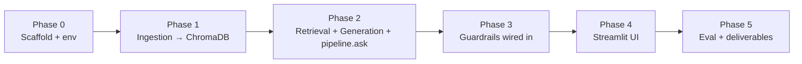

# Implementation Plan — MF FAQ Assistant (Facts-Only RAG Chatbot)

> **Purpose.** This is the phase-by-phase build plan Claude Code should execute. It turns `PRD.md` (what/why) and `architecture.md` (how) into ordered, verifiable phases. Each phase has an objective, the exact files + signatures to create, tasks, a **runnable verification**, and an **exit checkpoint**. Build in order — later phases depend on earlier ones.

## Execution protocol (read first)
1. **Execute ONE phase at a time**, top to bottom. Do not start a phase until the previous phase's exit criteria pass.
2. After each phase, **run the verification commands** and paste the actual output.
3. At each **✅ Checkpoint**, stop and report status; wait for the user's go-ahead before the next phase (the user asked for phased execution).
4. Honor the **data contracts in `architecture.md §4`** exactly — they are the interfaces between phases.
5. Never add knowledge outside `corpus/`, never compute returns, keep the **guard-first ordering** (`architecture.md §6/§8`).
6. Run every command **from the repo root** `rag-agent/`.

## Decisions locked for this plan (defaults; confirm at the noted phase)
- **Language/runtime:** Python 3.11 (mandated stack is Python: `sentence-transformers`, `chromadb`).
- **Embeddings:** `sentence-transformers/all-MiniLM-L6-v2` · **Vector DB:** ChromaDB (both brief-mandated).
- **Generation:** Mistral (`mistral-small-latest`, temp 0) via the `mistralai>=1.2,<2` SDK, key in `.env` **with a deterministic template fallback** so the app runs even with no/blocked key.
- **UI:** Streamlit — confirm in Phase 4.
- **Statement-guide intent gap** (PRD §19): scoped **out of v1** and handled as `not_found` unless the user adds a 6th official source — decide in Phase 5.

## Phase overview & dependencies

| Phase | Maps to PRD milestone | Output |
|---|---|---|
| 0 | (pre-M1) | runnable env + skeleton + `config.py` |
| 1 | M1 | persisted ChromaDB index |
| 2 | M2 | `pipeline.ask()` answers factual queries w/ citation |
| 3 | M3 | PII / advice / performance guards + post-check |
| 4 | M4 | Streamlit app (welcome + 3 examples + disclaimer) |
| 5 | M5 | sample Q&A, README, eval, demo — deliverables complete |

---

## Phase 0 — Project scaffold & environment
**Objective:** a working Python env and the empty module skeleton from `architecture.md §3`.

**⚠️ Known blocker (verify first):** on this machine the `python`/`python3` on PATH is the **Windows Store stub** (it prints an install prompt instead of running). Before anything else:
```bash
python --version        # if this opens the Store or errors → real Python is NOT installed
```
If it fails, install **Python 3.11 from python.org** (tick "Add to PATH"), or disable the Store alias (Settings → Apps → Advanced app settings → App execution aliases → turn off python.exe). Re-run until `python --version` prints `Python 3.11.x`.

**Tasks**
1. Create the tree (`app/ingest`, `app/retrieve`, `app/guardrails`, `app/generate`, `ui`, `data/chroma`, `eval`) with `__init__.py` in each `app/*` package.
2. Create a venv and activate it (Git Bash on Windows):
   ```bash
   python -m venv .venv
   source .venv/Scripts/activate     # Windows Git Bash; use .venv/bin/activate on macOS/Linux
   ```
3. Write **`requirements.txt`**: `sentence-transformers`, `chromadb`, `mistralai>=1.2,<2`, `python-dotenv`, `pyyaml`, `streamlit`. Then `pip install -r requirements.txt`.
4. Write **`config.py`** — copy the values from `architecture.md §7` verbatim (paths, `EMBED_MODEL`, `COLLECTION_NAME`, `TOP_K`, `SCHEME_K`, `DISTANCE_THRESHOLD`, `MAX_SENTENCES`, `GEN_MODE`, `MISTRAL_MODEL`/`MISTRAL_API_KEY`, and the full `SCHEME_ALIASES` map with real scheme strings from `corpus/sources.json`).
5. Write **`.gitignore`**: `.venv/`, `__pycache__/`, `data/chroma/`, `*.pyc`, `.env`.

**Verification**
```bash
python --version && pip show sentence-transformers chromadb | grep -i name
python -c "import config; print(config.EMBED_MODEL, config.TOP_K, len(config.SCHEME_ALIASES))"
```
Expect: Python 3.11.x, both packages found, and the config line prints the model name, `4`, and the alias count.

**✅ Checkpoint 0:** env activates, deps import, `config.py` loads. Report Python version + install result.

---

## Phase 1 — Ingestion pipeline (`Load → Chunk → Embed → Store`)
**Objective:** turn the 5 corpus docs into a persisted ChromaDB collection. (`architecture.md §5`)
**Depends on:** Phase 0.

**Files & signatures**
- `app/ingest/loader.py`
  - `@dataclass Doc: metadata: dict; body: str`
  - `parse_frontmatter(text: str) -> tuple[dict, str]` — split leading `---...---` YAML from body.
  - `load_corpus(corpus_dir: str = config.CORPUS_DIR) -> list[Doc]` — read every `*.md` **except `README.md`**; raise if any of `doc_id, scheme, source_url, nav_as_of` missing.
- `app/ingest/chunker.py`
  - `@dataclass Chunk: id: str; text: str; metadata: dict`
  - `slugify(s: str) -> str`
  - `chunk_doc(doc: Doc) -> list[Chunk]` — split body on lines matching `^## `; for each section build `text = f"{scheme} › {title}\n{body}"`, `id = f"{doc_id}::{slugify(title)}"`, metadata = doc metadata + `section=title` (see chunk record in `architecture.md §4.2`). Drop empty sections. Target ~150–350 tokens (PRD §10); no hard token split needed at this corpus size.
- `app/ingest/embedder.py`
  - `class Embedder` — lazy-load `SentenceTransformer(config.EMBED_MODEL)`; `encode(texts: list[str]) -> list[list[float]]` with `normalize_embeddings=True`. Expose a module-level singleton `get_embedder()`.
- `app/ingest/index.py`
  - `get_collection()` — `chromadb.PersistentClient(path=config.CHROMA_PATH).get_or_create_collection(config.COLLECTION_NAME, metadata={"hnsw:space": config.DISTANCE_METRIC})`.
  - `build_collection(chunks: list[Chunk]) -> int` — embed chunk texts, `collection.upsert(ids, embeddings, documents, metadatas)`, return count.
- `app/ingest/build_index.py`
  - `main()` — `load_corpus` → `chunk_doc` (flatten) → `build_collection` → print `#docs`, `#chunks`, sample ids. Runnable as `python -m app.ingest.build_index`.

**Verification**
```bash
python -m app.ingest.build_index
python -c "from app.ingest.index import get_collection as g; c=g(); print('chunks:', c.count()); print(c.peek(2)['ids'])"
```
Expect: `#docs = 5`, `chunks` ≈ 30–40, and peek prints real ids like `hdfc-small-cap-fund::exit-load`.

**✅ Checkpoint 1:** collection persisted under `data/chroma/`, count in the 30–40 range, ids well-formed.

---

## Phase 2 — Retrieval + generation + `pipeline.ask` (happy path)
**Objective:** answer an in-scope factual query end-to-end with one citation + freshness stamp — **guardrails come in Phase 3**. (`architecture.md §6` steps 3–10)
**Depends on:** Phase 1.
**Confirm with user:** generation mode — start in `GEN_MODE="template"` (no API key needed) and add the LLM adapter, or wire the Mistral call now. Default: build both; template is the fallback.

**Files & signatures**
- `app/retrieve/retriever.py`
  - `@dataclass RetrievedChunk: id: str; text: str; distance: float; metadata: dict`
  - `search(query: str, scheme_filter: str | None, k: int = config.TOP_K) -> list[RetrievedChunk]` — embed via `get_embedder()`, `collection.query(query_embeddings=[v], n_results=k, where={"scheme": scheme_filter} if scheme_filter else None)`, map results (Chroma returns nested lists).
  - `passes_gate(chunks) -> bool` — `chunks and min(distances) <= config.DISTANCE_THRESHOLD`.
- `app/generate/prompts.py` — string constants, copied from `PRD.md §12`: `SYSTEM_PROMPT` (answer only from context; ≤3 sentences; if absent, say not found; never advise or compute returns), `NOT_FOUND_MSG`, `REFUSAL_ADVICE`, `REFUSAL_PERFORMANCE`, `REFUSAL_PII`, `WELCOME`, `EXAMPLES`, `DISCLAIMER`.
- `app/generate/answerer.py`
  - `answer(query: str, chunks: list[RetrievedChunk], mode: str = config.GEN_MODE) -> str`
    - `mode == "llm"`: call Mistral `client.chat.complete(model=config.MISTRAL_MODEL, temperature=0, messages=[system=SYSTEM_PROMPT, user=context+query])`; read `MISTRAL_API_KEY` from `.env`.
    - `mode == "template"`: deterministic — return the most relevant sentence/line from the top chunk that matches the asked field. No invented facts.
- `app/pipeline.py`
  - `@dataclass AskResponse` — fields per `architecture.md §4.3` (`type, text, source_url, last_updated, citations, debug`).
  - `resolve_scheme(query: str) -> str | None` — match against `config.SCHEME_ALIASES` (case-insensitive).
  - `ask(query: str) -> AskResponse` — **Phase-2 scope:** resolve scheme → `search` → `passes_gate` false ⇒ `not_found` (+ official link from any/closest doc) → else `answer(...)` → attach citation = rank-1 chunk `source_url`, `last_updated` = human-formatted `nav_as_of`. Provide a `__main__` so `python -m app.pipeline "..."` prints the response.

**Verification**
```bash
python -m app.pipeline "What is the expense ratio of HDFC Small Cap Fund?"
python -m app.pipeline "What is the lock-in period for HDFC ELSS Tax Saver Fund?"
python -m app.pipeline "What is the portfolio turnover ratio of HDFC Large Cap Fund?"   # expect not_found
```
Expect: first two → `type=answer`, correct value (0.78% ; 3 years), one `source_url`, `last_updated="25 Sep 2026"`; third → `type=not_found` with an official link, no guessed number.

**✅ Checkpoint 2:** factual queries return grounded, single-cited, ≤3-sentence answers; missing-field query returns `not_found`. Report the three outputs.

---

## Phase 3 — Guardrails wired into the pipeline
**Objective:** enforce PII, advice/opinion, performance refusals **before** retrieval, and validate answers **after** generation. (`architecture.md §6 steps 1–2, 9; §8`; PRD §8, §13)
**Depends on:** Phase 2.

**Files & signatures**
- `app/guardrails/pii.py`
  - `contains_pii(text: str) -> tuple[bool, str | None]` — regexes: PAN `\b[A-Z]{5}[0-9]{4}[A-Z]\b`, Aadhaar `\b\d{4}\s?\d{4}\s?\d{4}\b`, email, 10-digit phone `\b[6-9]\d{9}\b`, "otp", long digit runs (account). Return `(True, kind)` on first match. **Never log the raw input.**
- `app/guardrails/intent.py`
  - `classify(query: str) -> Literal["factual","advice","performance"]` — `advice` if any of {should, buy, sell, best, worth, recommend, suitable, better, invest in}; `performance` if any of {compare returns, will it grow, projected, forecast, cagr, which gave more, outperform}; else `factual`. Keep keyword lists as module constants.
- `app/guardrails/postcheck.py`
  - `finalize(draft: str, source_url: str, last_updated: str) -> str` — trim to ≤`config.MAX_SENTENCES` sentences; strip any advice verbs/URLs the model may have added; **append exactly one** `Source: {source_url}` and `Last updated from sources: {last_updated}`. Citation comes from metadata, never the model.
- **Wire into `pipeline.ask`** at the front and end (final order per `architecture.md §6.1`):
  1. `contains_pii` → `refusal_pii` (stop; nothing stored).
  2. `classify` → `advice` ⇒ `refusal_advice` (+ AMFI edu link); `performance` ⇒ `refusal_performance` (+ factsheet link). Both stop **before** embedding/retrieval.
  3. factual → existing Phase-2 path, then `finalize(...)` in place of the manual citation append.

**Verification**
```bash
python -m app.pipeline "Should I buy HDFC Small Cap Fund?"           # refusal_advice, no retrieval
python -m app.pipeline "Which HDFC fund gave the best returns?"      # refusal_performance
python -m app.pipeline "My PAN is ABCDE1234F, please open an account" # refusal_pii, nothing stored
python -m app.pipeline "What is the benchmark of HDFC Large Cap Fund?" # still answers (NIFTY 100 TRI)
```
Expect: three correct refusals with the right copy + link, and the factual query still returns a valid cited answer. Confirm the advice/PII paths never call the retriever (add a debug flag or log line to prove short-circuit).

**✅ Checkpoint 3:** all four guardrail behaviors correct; factual path unbroken. Report the four outputs.

---

## Phase 4 — Streamlit UI
**Objective:** the "tiny UI" from PRD §12 — welcome line, 3 example questions, persistent disclaimer, chat. (`architecture.md §2`, PRD FR8)
**Depends on:** Phase 3.
**Confirm with user:** Streamlit vs static HTML+JS (default Streamlit).

**File**
- `ui/streamlit_app.py`
  - Header/welcome from `prompts.WELCOME`; three clickable example buttons from `prompts.EXAMPLES` that submit the query; a text input; footer `prompts.DISCLAIMER` always visible.
  - On submit: call `app.pipeline.ask(query)`; render `text`; if `type=="answer"` show `Source:` (clickable) + `Last updated from sources:` lines; style refusals distinctly.
  - No storage of user inputs.

**Verification**
```bash
streamlit run ui/streamlit_app.py
```
Manual: welcome + 3 examples + disclaimer visible; clicking an example returns a cited answer; an advice question shows the refusal. Capture 2–3 screenshots for the demo deliverable.

**✅ Checkpoint 4:** app runs locally; examples and a refusal verified in-browser.

---

## Phase 5 — Evaluation & deliverables
**Objective:** produce the brief's deliverables and prove the acceptance criteria (PRD §5, §18).
**Depends on:** Phase 4.
**Decide with user:** the statement-guide gap (PRD §19) — add a 6th official source (re-run Phase 1) or keep it scoped out (`not_found`).

**Files & tasks**
- `eval/sample_qa.md` — the 5–10 queries from PRD §14 with the assistant's actual answers + links (deliverable: Sample Q&A).
- `eval/run_eval.py` — run each query through `ask`; assert: every `answer` has exactly 1 citation and a `last_updated`; every advice/perf/PII query returns the matching refusal `type`; every answer ≤3 sentences. Print a pass/fail table.
- `README.md` (repo root) — setup steps (venv, install, `build_index`, `streamlit run`), scope (AMC + 5 schemes), and known limits (point-in-time data, statement-guide gap, Groww as public source). (Deliverable: README.)
- **Disclaimer snippet** — reference/copy `PRD.md §12` persistent disclaimer (deliverable).
- **Prototype/demo** — hosted link **or** a ≤3-min demo video / screenshots (deliverable).

**Verification**
```bash
python eval/run_eval.py
```
Expect: 100% citation coverage on factual answers, 100% correct refusals, all answers ≤3 sentences.

**✅ Checkpoint 5 (Definition of Done):** map to PRD §18 deliverables checklist:
- [ ] Working prototype (Streamlit) or ≤3-min demo — Phase 4/5
- [x] Source list (5 URLs) — `corpus/sources.csv` + `.json` (done in M0)
- [ ] README (setup, scope, limits) — Phase 5
- [ ] Sample Q&A (5–10) — Phase 5
- [x] Disclaimer snippet — PRD §12 / `prompts.py`
- [x] Corpus (5 public pages) — `corpus/` (done in M0)

---

## Cross-cutting rules (apply in every phase)
- **Idempotence:** `build_index` upserts by id — safe to re-run after corpus edits.
- **No secrets in code:** `MISTRAL_API_KEY` via `.env` (git-ignored); app must run in `template` mode without it.
- **Determinism for facts:** LLM temperature 0; citations and freshness come from metadata, not generation.
- **Fail loud, don't guess:** missing corpus/collection → clear "run Phase 1" error; missing field → `not_found`, never a fabricated value.
- **Traceability:** keep `debug` populated in `AskResponse` (intent, scheme_filter, retrieved_ids, top_distance) for eval and troubleshooting.

*Cross-refs: requirements → `PRD.md`; structure & data flow → `architecture.md`; brief → `docs/Buildhour-27th-sept-brief.docx`.*
